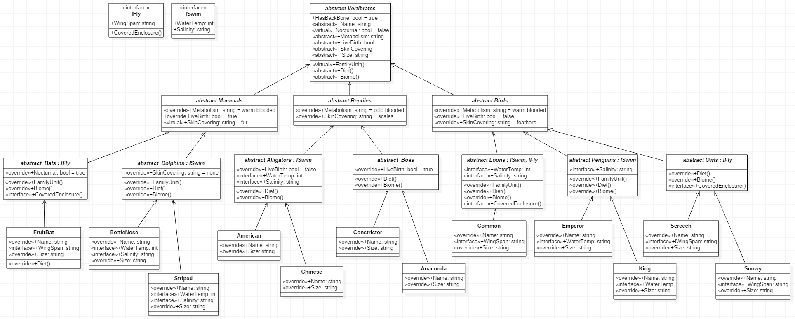

# LAB05-OOP_Principals

## Introduction

This project is an exercise in utilizing the principals of Object Oriented Programming.

> -Inheritance is used to implement base class functionality in derivitive classes.

> -Abstraction is used when creating base classes that are not particually associtated with derivative classes and cannot be instansiated.

> -Polymorphism is used as objects of derived classes can be treated as objects of the base classes.

> -Encapsulation is used to prevent access to implementation details.

## Visuals

---
## Breakdown

#### Inheritance

Classes can inherit properties and behaviors of base classes.
For example, all animals in my zoo inherit the "HasBackBone" property because all of the animals inherit from the base class of Vertibrates.

#### Abstraction

The base class is not associated with any particular instance.
Creating a new "FruitBat" does not have any effect on the class of Vertibrates.
Only concrete classes can be instansiated.

#### Polymorphism

Derived objects can be treated similarly to base class objects.
Calling .FamilyUnit() from a BottleNose instantiation is similar to the behavior of calling it from any Dolphin instantiation.

#### Encapsulation

Preventing access to implementation details.
By using 'protected' classes, you limit implementation and visibility to only a scope within the class and child classes.

#### Interfaces

Interfaces are used to define interaction with an object.

You can use several types of balls as an example, i.e. a football, baseball, and a basketball.

All three of these objects can be thorwn, but none of their throwing operations are the same.
Each is 'throwable' and provides it's own throwing implementation.

In this project, I defined my interfaces as IFly and ISwim, which define the Animal-object's ability to either Fly or Swim.
